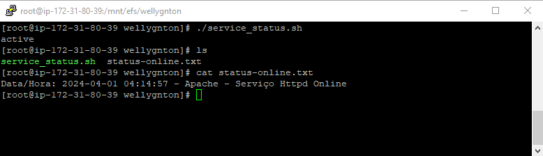

<h1 align="center">ATIVIDADE LINUX AWS</h1>

<h2>Requisitos AWS</h2>
<ul>
    <li>Gerar uma chave pública para acesso ao ambiente;</li>
    <li>Criar 1 instância EC2 com o sistema operacional Amazon Linux 2 (Família t3.small, 16 GB SSD);</li>
    <li>Gerar 1 elastic IP e anexar à instância EC2;</li>
    <li>Liberar as portas de comunicação para acesso público: (22/TCP, 111/TCP e UDP, 2049/TCP/UDP, 80/TCP, 443/TCP).</li>
</ul>

<h2>Requisitos Linux</h2>
<ul>
    <li>Configurar o NFS entregue;</li>
    <li>Criar um diretorio dentro do filesystem do NFS com seu nome;</li>
    <li>Subir um apache no servidor - o apache deve estar online e rodando;</li>
    <li>Criar um script que valide se o serviço esta online e envie o resultado da validação para o seu diretorio no nfs;</li>
    <li>O script deve conter - Data HORA + nome do serviço + Status + mensagem personalizada de ONLINE ou offline;</li>
    <li>O script deve gerar 2 arquivos de saida: 1 para o serviço online e 1 para o serviço OFFLINE;</li>
    <li>Preparar a execução automatizada do script a cada 5 minutos.</li>
</ul>

<h2>Desenvolvimento da Atividade</h2>

<h3>AWS – Criação da Chave Pública</h3>
Existem duas maneiras de se criar uma chave pública na AWS, tanto pelo painel EC2 na lateral esquerda na opção “Pares de Chaves” ou durante o processo de criação de uma instância.
<ol>
    <li>Acesse os serviços de EC2 da AWS;</li>
    <li>No painel lateral esquerdo selecione a opção “Pares de Chaves”;</li>
    <li>Vá até a opção “Criar par de chaves” no canto superior direito;</li>
    
    <li>Com o painel aberto escolha um nome para o par de chaves;</li>
    <li>Em seguida mantenha o tipo de par de chaves no formato padrão RSA;</li>
    <li>Em “Formato de arquivo de chave privada” selecione a opção .ppk, necessária para o acesso via PuTTY como iremos fazer;</li>
    <li>Ao final, clique em “Criar par de chaves”;</li>
    <li>Salve o arquivo que será gerado em um local seguro;</li>
    <li>Pronto, o par de chaves está criado e será listada em “Pares de Chaves”.</li>
</ol>

<h3>AWS –  Criar 1 instância EC2 com o sistema operacional Amazon Linux 2 (Família t3.small, 16 GB SSD);</h3>
<ol>
    <li>Vá até “Instâncias” no painel lateral esquerdo;</li>
    <li>Selecione a opção “Executar Instâncias” no canto superior direito;</li>
    <li>Com o painel aberto podemos definir nome e tags para a nossa instância; </li>
    <li>Em seguida escolheremos o Sistema operacional Amazon Linux 2 AMI (HVM);</li>
    
    <li>O tipo de instância que será t3.small;</li>
    <li>Em “Par de chaves” iremos escolher nossa chave criada anteriormente;</li>
    <li>Nas configurações de rede selecione a opção “criar grupo de segurança” e mantenha marcada a opção “Permitir tráfego SSH de qualquer lugar (0.0.0.0/0);</li>
    
    <li>Em “Configuração de armazenamento” coloque 16gb SSD de uso geral (gp2);</li>
    
    <li>Verifique se todas as informações estão corretas e em seguida clique na opção “Executar Instância”.</li>
</ol>

Antes de criarmos o Elastic IP, deveremos criar um Gateway de Internet para que seja possível a conexão da rede com a internet.

<h3>AWS – Criando Gateway de Internet</h3>
<ol>
    <li>Na barra de pesquisa do console da AWS, busque pelo serviço de VPC;</li>
    <li>Clique em “Gateways da Internet” no painel esquerdo;</li>
    <li>Vá até a opção “Criar gateway da internet” no canto superior direito;</li>
    <li>Defina um nome para o gateway e clique em “criar gateway da internet”;</li>
    <li>Ainda no painel atual clique em “Ações” e logo em seguida em “Associar à VPC”;</li>
    <li>Escolha a VPC da instância criada anteriormente e clique em “Associar gateway da internet”.</li>
</ol>

<h3>AWS - Gerar 1 elastic IP e anexar à instância EC2</h3>
<ol>
    <li>No Painel de EC2 clique na opção “IPs Elásticos”;</li>
    <li>Vá até a opção “Alocar endereço IP elástico” no canto superior direito;</li>
    <li>Mantenha todas as opções como padrão e clique em “Alocar”;</li>
    <li>Ainda no painel selecione o IP gerado e clique “Ações”, logo em seguida clique em “Associar endereço IP elástico”;</li>
    <li>Selecione a instância criada anteriormente e o endereço IP privado da mesma e clique em “Associar”;</li>
    
</ol>

<h3>AWS - Liberar as portas de comunicação para acesso público: (22/TCP, 111/TCP e UDP, 2049/TCP/UDP, 80/TCP, 443/TCP).</h3>
<ol>
    <li>No Painel EC2 vá até “Security Groups” na lateral esquerda;</li>
    <li>Selecione o security group criado anteriormente;</li>
    <li>Na parte inferior do painel clique em “Regras de entrada” e logo em seguida em “Editar regras de entrada”;</li>
    <li>Por padrão já temos uma regra de entrada do tipo SSH, protocolo TCP e porta 22;</li>
    <li>Adicionaremos as demais regras mantendo a regra do tipo SSH;</li>
    <li>Clique em “Salvar regras”.</li>
    
</ol>

Para que o nosso acesso via PuTTY a partir de uma máquina Windows seja possível, precisaremos ainda configurar a tabe de rotas.

<h3>AWS – Configurando a tabela de rotas</h3>
<ol>
    <li>Acesse o serviço de VPC, em seguida clique na opção “Tabelas de rotas” no painel esquerdo;</li>
    <li>Selecione a tabela de rotas da VPC da instância criada anteriormente;</li>
    <li>Vá até “Ações” e em seguida “Editar rotas”;</li>
    <li>Clique em “Adicionar rota”;</li>
    <li>Em destino escolha 0.0.0.0/0 e em alvo “Gateway da internet”;</li>
    <li>Logo a baixo selecione o gateway criado anteriormente e clique em “Salvar alterações”.</li>
    
</ol>

<h3>AWS - Criando o serviço de Elastic File System (EFS)</h3>
<ol>
    <li>Na barra de pesquisa do console da AWS busque por EFS;</li>
    <li>Dentro do painel vá até “Criar sistema de arquivos”;</li>
    <li>Defina um nome e clique em “Personalizar”;</li>
    <li>No tipo de sistema de arquivos selecione “One Zone”;</li>
    <li>Mantenha o restante das configurações por padrão e clique em “Próximo”;</li>
    <li>Em rede altere apenas o security group, usaremos o security group criado anteriormente;</li>
    <li>Mantenha o restante das configurações como padrão, revise todas as informações e clique em “criar”.</li>
    
    <li>Ainda no painel, clique no sistema de arquivos criado;</li>
    <li>Ao clicar em “Anexar” no canto superior direito o painel nós mostrará os comando para montagem do sistema de arquivos;</li>
    <li>Utilizaremos a opção de montagem via DNS, copie o segundo comando e salve em um bloco de notas.</li>
</ol>

Finalizamos aqui as configurações do nosso ambiente AWS, em seguida iremos configurar nossa máquina Linux.
Faremos o acesso via PuTTY, para isso o mesma precisará está devidamente instalado na sua máquina Windows. O PuTTY é um cliente SSH gratuito para Windows.

<h3>PuTTY – Acessando a instância via PuTTY</h3>
<ol>
    <li>Vá até sua instância EC2, selecione a mesma e clique em “conectar”;</li>
    <li>Abra a aba “Cliente SSH” e copie o DNS público da instância;</li>
    <li>Inicie o PuTTY em sua máquina;</li>
    <li>Em “Category” clique em “Session”;</li>
    
    <li>Em “Host Name” cole o DNS público de sua instância;</li>
    <li>No tipo de conexão selecione SSH e a porta 22;</li>
    <li>Em seguida clique em “Connection”, depois “SSH”, “Auth” e por fim “credentials”;</li>
    <li>Em “Public-key authentication” na parte de “Private key file for authentication” clique em “Browse”, logo em seguida selecione o arquivo de par de chaves em formato .ppk que foi gerado no momento da criação de par de chaves;</li>
    <li>Ao clicar em “Open” no canto inferior direto, o PuTTY fará a conexão com a nossa instância;</li>
    <li>Se caso for seu primeiro acesso, o PuTTY exibirá uma janela de alerta perguntando se confia no host e se deseja continuar. Clique em “Accept”;</li>
    <li>Em seguida a tela do terminal de nossa instância será aberto.</li>
    
</ol>

<h3>LINUX – Configurando o NFS entregue</h3>
As configurações serão feitas diretamente no terminal Linux da instância EC2 que criamos.

<ol>
    <li>Entre com o comando <code>sudo su</code> para ganhar privilégios administrativos;</li>
    <li>Execute o comande de atualização do sistema sudo yum update -y para atualização de pacotes do Linux;</li>
    <li>Com o comando <code>sudo yum install -y amazon-efs-utils</code> faremos a instalação de pacotes de suporte ao NFS, que permite compartilhar diretórios e arquivos entre sistemas operacionais em uma rede.;</li>
    <li>Com o comando <code>mkdir /mnt/efs</code> criaremos o diretório <code>/efs</code> dentro do diretório <code>/mnt</code>, que é o diretório de montagem de sistema de arquivos externos do Linux que servirá como nosso ponto de montagem;;</li>
    <li>Para montarmos o sistema de arquivos iremos utilizar o comando copiado anteriormente do console da AWS em sistemas de arquivos <code>(sudo mount -t nfs4 -o nfsvers=4.1,rsize=1048576,wsize=1048576,hard,timeo=600,retrans=2,(DNS do cliente EFS):/ (caminho local))</code>;</li>
    <li>Confirme se o sistema de arquivos EFS está montado corretamente usando o comando <code>df -h</code>.</li>
    
</ol>

<h3>LINUX – Configurando o Apache</h3>
<ol>
    <li>Execute o comande de atualização do sistema <code>sudo yum update -y</code> para atualização de pacotes do Linux;</li>
    <li>Use o comando <code>sudo yum install httpd -y</code> para instalar o Apache;</li>
    <li>Use o comando <code>sudo systemctl start httpd</code> para iniciar o Apache;</li>
    <li>Para que o Apache seja iniciado automaticamente, execute o comando <code>sudo systemctl enable httpd</code>;</li>
    <li>Para o Apache iniciar automaticamente, execute o comando <code>sudo systemctl enable httpd</code>;</li>
    <li>Utilize o comando <code>sudo systemctl status httpd</code> para verificar se o Apache está em execução;</li>
    
</ol>

<h3>LINUX – Criando um script que valide se o serviço esta online e envie o resultado da validação para o seu diretorio no nfs</h3>
<ol>
    <li>Execute o comando <code>nano service_status.sh</code> para criar e abrir o arquivo do script. O script e os arquivos de log deverão está dentro de um diretório com o nome do autor, como sugerido na atividade, então no meu caso o caminho deverá ser mtn/efs/Wellygnton;</li>
    <li>Dentro do arquivo, digite o script desejado;</li>
    
    <li>Utilizando as condicionais If e else, serão criados os dois arquivos de log em formato .txt de acordo com os resultados da verificação. Um arquivo para status de serviço online e outra para offline.</li>
    <li>Salve o arquivo e feche o script;</li>
    <li>Para tornar o arquivo do script executável digite o comando <code>sudo chmod +x service_status.sh</code>;</li>
    <li>Execute o comando <code>./service_status.sh</code> para executar o script. O script ira criar o arquivo de log .txt com as informações de validação online;</li>
    <li>Podemos visualizar o arquivo com o comando <code>cat status-online.txt</code>;</li>
    
</ol>